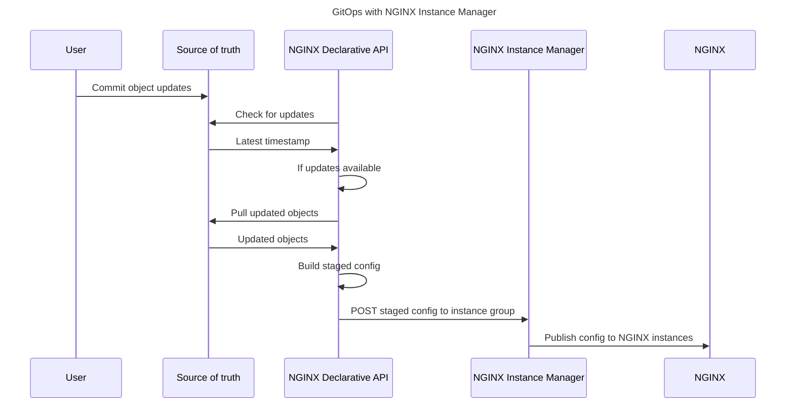

# NGINX-Declarative-API

This tool provides a set of declarative REST API for NGINX Instance Manager.

It can be used to manage NGINX Plus configuration lifecycle and to create NGINX Plus configurations using JSON service definitions.

GitOps integration is supported when used with NGINX Instance Manager: source of truth is checked for updates (NGINX App Protect policies, TLS certificates, keys and chains/bundles) and NGINX configurations are automatically kept in sync.

Use cases include:

- Rapid configuration generation and templating
- CI/CD integration with NGINX Instance Manager (instance groups and staged configs)
- GitOps integration with source of truth support for
  - NGINX App Protect WAF policies
  - TLS certificates, keys and chains/bundles
  - mTLS certificates
  - `http` snippets, upstreams, servers, locations
  - `stream` snippets, upstreams, servers

## Requirements

- NGINX Instance Manager 2.10+
- NGINX Plus R30 or newer

## Architecture


## GitOps



## Input formats

- [X] Declarative REST API

## Output formats

- [X] Plaintext
- [X] JSON-wrapped Base64-encoded
- [X] Kubernetes Configmap
- [X] POST to Generic REST API endpoint
- [X] Output to NGINX Instance Manager 2.1.0+ imperative REST API
  
## Supported NGINX Plus features

| Feature                    | API v3                                                                                  | Notes                                                                                            |
|----------------------------|-----------------------------------------------------------------------------------------|--------------------------------------------------------------------------------------------------|
| Upstreams                  | CRUD                                                                                    | Snippets supported: static and from source of truth                                              |
| HTTP servers               | CRUD                                                                                    | Snippets supported (`http`, `servers`, `locations`, `upstreams`: static and from source of truth |
| TCP/UDP servers            | CRUD                                                                                    | Snippets supported (`streams`, `servers`, `upstreams`: static and from source of truth           |
| TLS                        | CRUD                                                                                    | Certificates and keys can be dynamically fetched from source of truth                            |
| mTLS                       | CRUD                                                                                    | Certificates and keys can be dynamically fetched from source of truth                            |
| Rate limiting              | X                                                                                       |                                                                                                  |
| Active healthchecks        | X                                                                                       |                                                                                                  |
| Cookie-based stickiness    | X                                                                                       |                                                                                                  |
| Maps                       | X                                                                                       |                                                                                                  |
| NGINX Plus REST API access | X                                                                                       |                                                                                                  |
| NGINX App Protect WAF      | Per-policy CRUD at `server` and `location` level with dataplane-based bundle compilation | Security policies can be dynamically fetched from source of truth                               | 
| API Gateway                | Swagger and OpenAPI YAML and JSON schema support                                        | Automated configuration, HTTP methods and rate limiting enforcement                              | 

## How to use

Usage details and JSON schema are available here:

- [API v3](/USAGE-v3.md) - current

A sample Postman collection and usage instructions can be found [here](/contrib/postman)

### Using docker-compose

This is the recommended method to run NGINX Declarative API on a Linux virtual machine. Refer to [installation instructions](https://github.com/fabriziofiorucci/NGINX-Declarative-API/tree/main/contrib/docker-compose)

### As a Python application

This repository has been tested with and requires Python 3.9 or newer.
A running instance of [redis](https://redis.io/) is required: redis host and port can be configured in the `config.toml` file.

Run NGINX Declarative API using:

```
$ git clone https://github.com/fabriziofiorucci/NGINX-Declarative-API
$ cd NGINX-Declarative-API/src
$ pip install -r requirements.txt
$ python3 main.py
```

### As a Docker image

The docker image can be built and run using:

```
$ git clone https://github.com/fabriziofiorucci/NGINX-Declarative-API
$ cd NGINX-Declarative-API
$ docker build -t nginx-declarative-api:latest -f contrib/docker/Dockerfile .
$ docker run --name nginx-declarative-api -d -p 5000:5000 nginx-declarative-api:latest
```

Pre-built docker images are available on Docker Hub at https://hub.docker.com/repository/docker/fiorucci/nginx-declarative-api/general and can be run using:

```
$ docker run --rm --name nginx-declarative-api -d -p 5000:5000 <IMAGE_NAME>
```

Pre-built images are configured to access the redis instance on host:port `127.0.0.1:6379`. This can be changed by mounting a custom `config.toml` file on the `nginx-declarative-api` container.

## REST API documentation

When NGINX Declarative API is running, REST API documentation can be accessed at:

- Documentation and testing: http://127.0.0.1:5000/docs
- Redoc documentation: http://127.0.0.1:5000/redoc
- OpenAPI specification: http://127.0.0.1:5000/openapi.json
