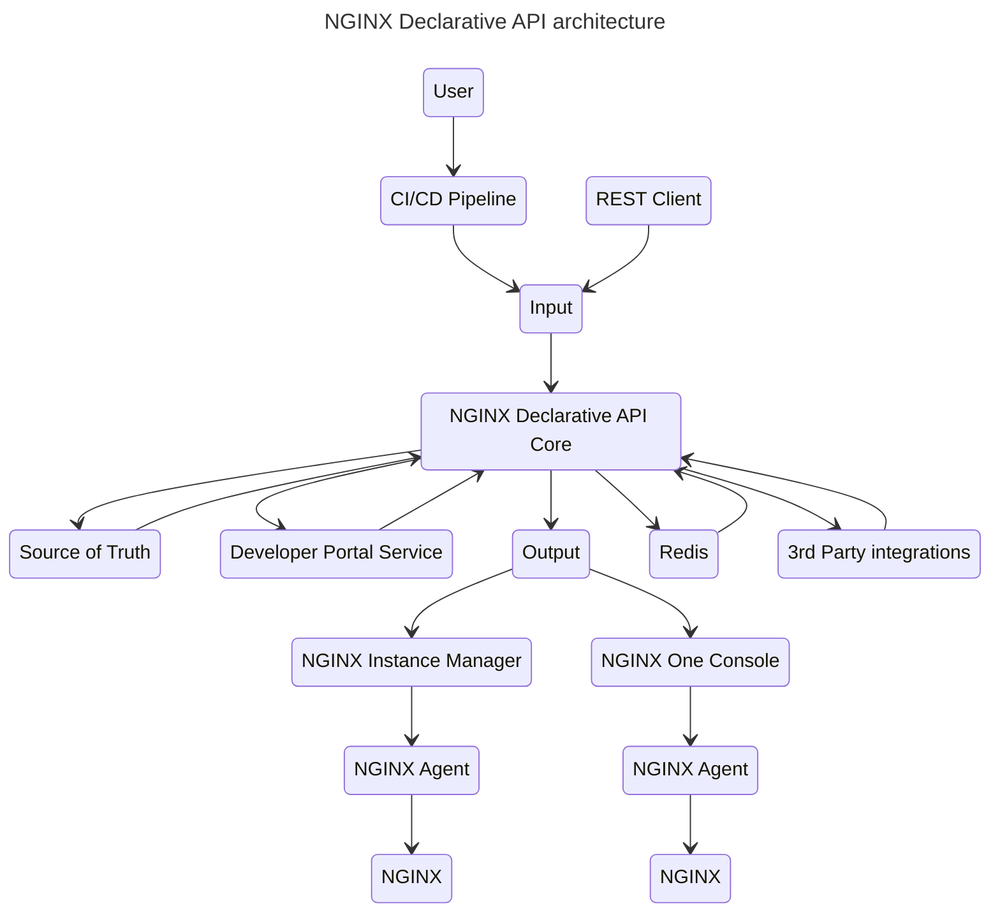
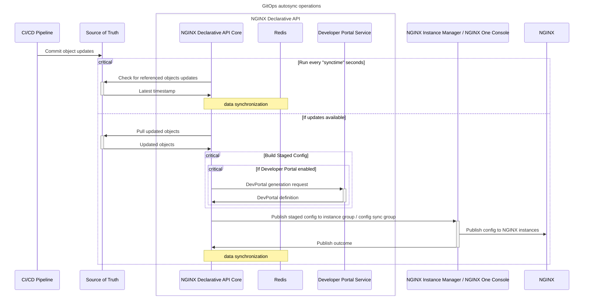

# NGINX-Declarative-API

This project provides a set of declarative REST API for [NGINX Instance Manager](https://docs.nginx.com/nginx-management-suite/nim/) and [NGINX One Console](https://docs.nginx.com/nginx-one/)

It can be used to manage NGINX Plus configuration lifecycle and to create NGINX Plus configurations using JSON service definitions.

GitOps integration is supported: source of truth is checked for updates (NGINX App Protect policies, TLS certificates, keys and chains/bundles, Swagger/OpenAPI definitions, snippets) and NGINX configurations are automatically kept in sync.

Use cases include:

- Integration with NGINX Instance Manager (instance group) and NGINX One Console (config sync group)
- NGINX App Protect DevSecOps integration (NGINX Instance Manager only)
- API Gateway deployments with automated Swagger / OpenAPI schema import
- API Developer portals zero-touch deployment (redocly and backstage supported)
- API Visibility (moesif supported)
- GitOps integration with source of truth support for
  - NGINX App Protect WAF policies
  - TLS certificates, keys and chains/bundles
  - mTLS certificates
  - `http` snippets, upstreams, servers, locations
  - `stream` snippets, upstreams, servers
  - Swagger / OpenAPI schemas
  - NGINX Javascript

A **blog article** to automate NGINX API Gateway management from OpenAPI schemas is available [here](https://www.f5.com/company/blog/nginx/from-openapi-to-nginx-as-an-api-gateway-using-a-declarative-api)

## Supported releases

- [NGINX Instance Manager 2.14+](https://docs.nginx.com/nginx-management-suite/nim/)
- [NGINX One Console](https://docs.nginx.com/nginx-one/)
- [NGINX Plus R30+](https://docs.nginx.com/nginx/)
- NGINX App Protect WAF [4](https://docs.nginx.com/nginx-app-protect-waf/v4/) and [5](https://docs.nginx.com/nginx-app-protect-waf/v5/)

**Note**: NGINX Plus R33 and above [require a valid license](https://docs.nginx.com/solutions/about-subscription-licenses/) and the `.output.license` section in the declarative JSON is required. See the [usage notes](/USAGE-v5.2.md) for further details. [Postman collection](/contrib/postman) examples are provided for R33.

## Architecture

## GitOps Autosync Mode

## Input formats

- [X] Declarative JSON

## Output formats

- [X] Output to NGINX Instance Manager 2.14+ imperative REST API (instance group)
- [X] Output to NGINX One Console REST API (config sync group)
  
## Supported features

See the [features list](/FEATURES.md)

## How to use

Usage details and JSON schema are available here:

- [API v5.2](/USAGE-v5.2.md) - latest - required for NGINX Plus R33+
- [API v5.1](/USAGE-v5.1.md)
- [API v5.0](/USAGE-v5.0.md) - deprecated

A sample Postman collection and usage instructions can be found [here](/contrib/postman)

## How to run

NGINX Declarative API can be deployed on a Linux virtual machine using [docker-compose](/contrib/docker-compose) or on [Kubernetes](/contrib/kubernetes)

## Building Docker images

Docker images can be built and run using the Docker compose [script](/contrib/docker-compose) provided

## REST API documentation

When NGINX Declarative API is running, REST API documentation can be accessed at:

- Documentation and testing: `/docs`
- Redoc documentation: `/redoc`
- OpenAPI specification: `/openapi.json`

## License

This repository is licensed under the Apache License, Version 2.0. You are free to use, modify, and distribute this codebase within the terms and conditions outlined in the license. For more details, please refer to the [LICENSE](/LICENSE.md) file.

## Support

For support, please open a GitHub issue. Note that the code in this repository is community supported.

## Contributing

See [Contributing](/CONTRIBUTING.md)

## Code of Conduct

See the [Code of Conduct](/code_of_conduct.md)
