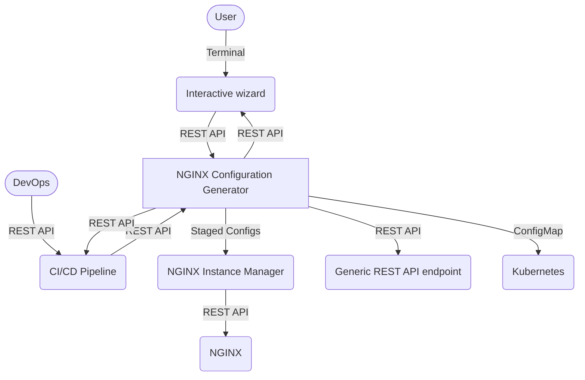

# NGINX-Config-Generator

This tool creates NGINX Plus configuration files for a given JSON service declaration.

Use cases include quick configuration generation and templating, and CI/CD integration with NGINX Instance Manager's instance groups and staged configs.

## Architecture



## Branches

Two branches are currently available:

- [Python](https://github.com/fabriziofiorucci/NGINX-Config-Generator/tree/main)
- [Node.js](https://github.com/fabriziofiorucci/NGINX-Config-Generator/tree/nodejs)

## Input formats

- [X] REST API
- [ ] Interactive wizard

## Output formats

- [X] Plaintext
- [X] JSON-wrapped Base64-encoded
- [X] Kubernetes Configmap
- [X] POST to Generic REST API endpoint
- [X] NGINX Instance Manager 2.1.0+ staged config / instance group interoperability
  
## Supported NGINX Plus configurations

- [X] Upstreams
- [X] Servers (HTTP services)
- [X] Servers (TCP & UDP services)
- [X] TLS (HTTP and TCP services)
- [X] Locations
- [X] Rate limiting
- [X] Active healthchecks
- [X] Cookie-based stickiness
- [X] NGINX Plus REST API access
- [X] NGINX App Protect policies and log formats (at `server` and `location` level)
- [X] Custom configuration snippets (for upstreams, servers, locations)
- [ ] Caching

## How to use

This repository requires Python 3.7 or newer.
Run NGINX Config Generator using:

```
$ cd src
$ pip install -r requirements.txt
$ python3 main.py
```

Usage details and JSON schema are available [here](/USAGE.md)

A sample Postman collection can be found [here](/postman)

## REST API documentation

When NGINX Config Generator is running, REST API documentation can be accessed at:

- Documentation and testing: http://127.0.0.1:5000/docs
- Redoc documentation: http://127.0.0.1:5000/redoc
- OpenAPI specification: http://127.0.0.1:5000/openapi.json