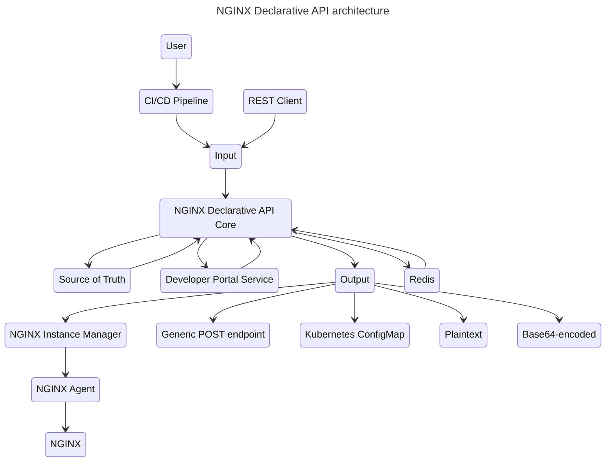
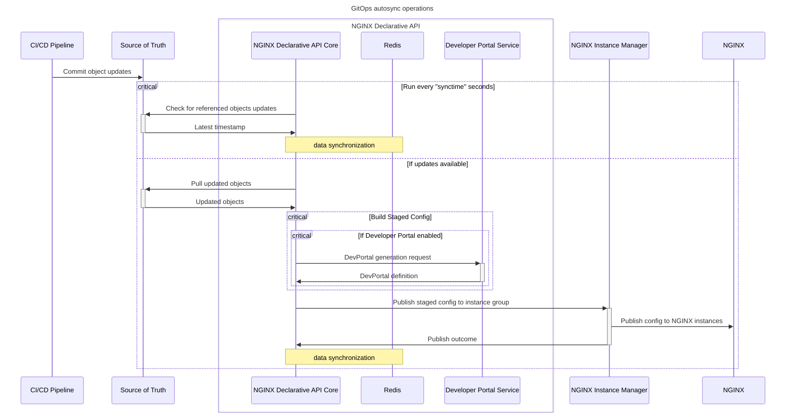

# NGINX-Declarative-API

This project provides a set of declarative REST API for [NGINX Instance Manager](https://docs.nginx.com/nginx-management-suite/nim/).

It can be used to manage NGINX Plus configuration lifecycle and to create NGINX Plus configurations using JSON service definitions.

GitOps integration is supported when used with NGINX Instance Manager: source of truth is checked for updates (NGINX App Protect policies, TLS certificates, keys and chains/bundles, Swagger/OpenAPI definitions) and NGINX configurations are automatically kept in sync.

Use cases include:

- Rapid configuration generation and templating
- CI/CD integration with NGINX Instance Manager (instance groups and staged configs)
- NGINX App Protect DevSecOps integration
- API Gateway deployments with automated Swagger / OpenAPI schema import
- API Developer portals zero-touch deployment
- GitOps integration with source of truth support for
  - NGINX App Protect WAF policies
  - TLS certificates, keys and chains/bundles
  - mTLS certificates
  - `http` snippets, upstreams, servers, locations
  - `stream` snippets, upstreams, servers
  - Swagger / OpenAPI schemas

## Requirements

- NGINX Instance Manager 2.14+
- NGINX Plus R30 or newer

## Architecture

## GitOps Autosync Mode

## Input formats

- [X] Declarative REST API

## Output formats

- [X] Plaintext
- [X] JSON-wrapped Base64-encoded
- [X] Kubernetes Configmap
- [X] POST to Generic REST API endpoint
- [X] Output to NGINX Instance Manager 2.14+ imperative REST API
  
## Supported features

See the [features list](/FEATURES.md)

## How to use

Usage details and JSON schema are available here:

- [API v4.1](/USAGE-v4.1.md) - latest
- [API v4.0](/USAGE-v4.0.md)
- [API v3.1](/USAGE-v3.1.md)

A sample Postman collection and usage instructions can be found [here](/contrib/postman)

## How to run

Docker-compose is the recommended method to run NGINX Declarative API on a Linux virtual machine. Full details are available [here](https://github.com/f5devcentral/NGINX-Declarative-API/tree/main/contrib/docker-compose)

## Building Docker images

Docker images can be built and run using:

    git clone https://github.com/f5devcentral/NGINX-Declarative-API

    cd NGINX-Declarative-API
    docker build --no-cache -t nginx-declarative-api -f ./Dockerfile .
    docker run --name nginx-declarative-api -d -p 5000:5000 nginx-declarative-api

    cd contrib/devportal
    docker build --no-cache -t nginx-declarative-api-devportal .
    docker run --name devportal -d -p 5001:5000 nginx-declarative-api-devportal

Pre-built docker images are available on Docker Hub at
- https://hub.docker.com/repository/docker/fiorucci/nginx-declarative-api/general
- https://hub.docker.com/repository/docker/fiorucci/nginx-declarative-api-devportal/general

Configuration can be customized mounting `config.toml` as a volume `nginx-declarative-api` docker image as a volume to customize 

## REST API documentation

When NGINX Declarative API is running, REST API documentation can be accessed at:

- Documentation and testing: `http://<NGINX_DECLARATIVE_API_ADDRESS>:5000/docs`
- Redoc documentation: `http://<NGINX_DECLARATIVE_API_ADDRESS>:5000/redoc`
- OpenAPI specification: `http://<NGINX_DECLARATIVE_API_ADDRESS>:5000/openapi.json`

## License

This repository is licensed under the Apache License, Version 2.0. You are free to use, modify, and distribute this codebase within the terms and conditions outlined in the license. For more details, please refer to the [LICENSE](/LICENSE.md) file.

## Support

See [Support](/SUPPORT.md)

## Contributing

See [Contributing](/CONTRIBUTING.md)

## Code of Conduct

See the [Code of Conduct](/code_of_conduct.md)
