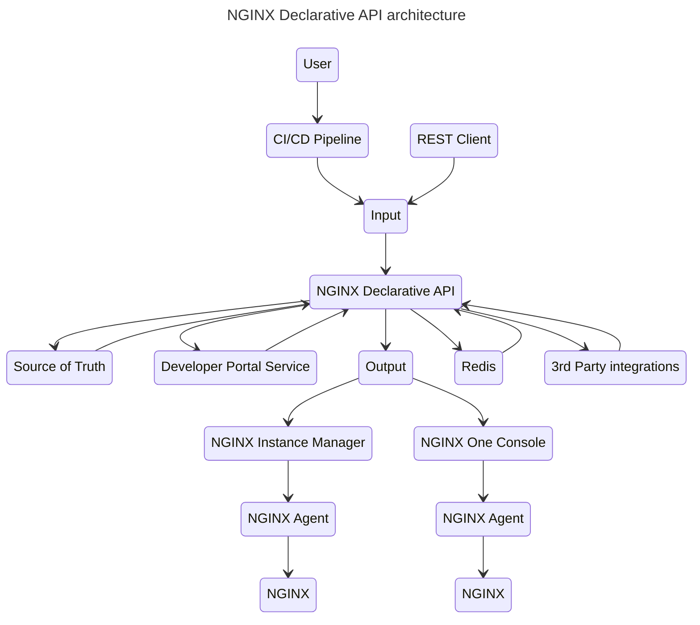
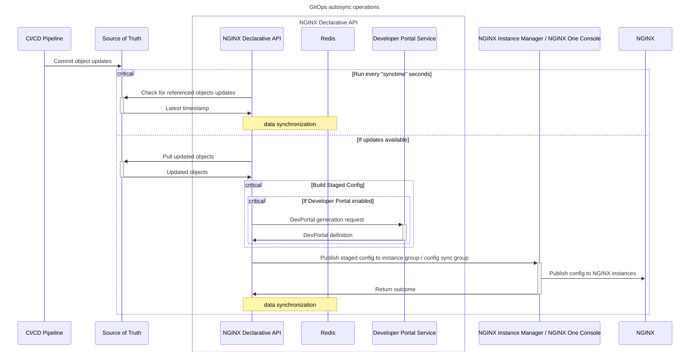
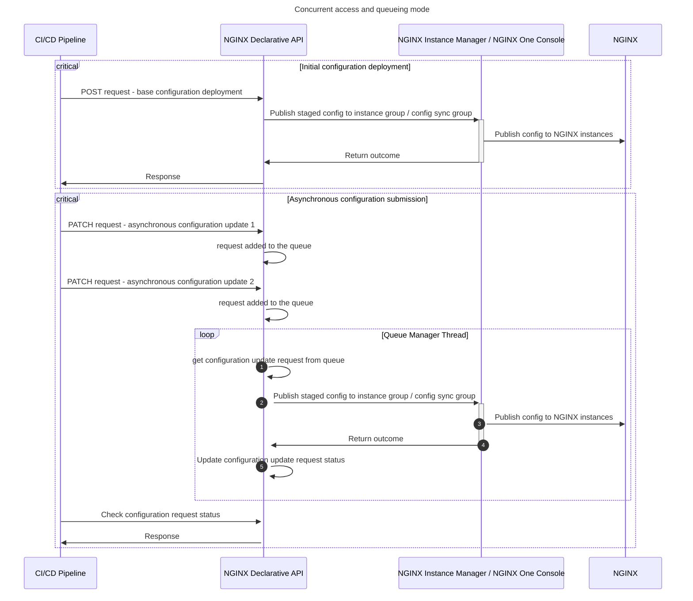

# NGINX-Declarative-API

NGINX Declarative API enables users to manage **NGINX configurations** in a modern **declarative style**. Instead of modifying configurations manually or using low-level APIs, this project simplifies operational workflows by allowing users to express desired configurations as a single JSON object.
The API abstracts the complexity of managing NGINX configurations, empowering developers, operators, and automation systems to integrate seamlessly with NGINX.

This project supports [F5 NGINX Instance Manager](https://docs.nginx.com/nginx-instance-manager/) and [F5 NGINX One Console](https://docs.nginx.com/nginx-one/)

## 📚 Overview

At its core, the NGINX Declarative API supports **declarative configuration management** by letting users define what the state of NGINX *should be*, rather than how to get there. It eliminates the need for procedural changes by processing user-defined JSON payloads into valid and optimized NGINX configurations. 

This tool is ideal for managing NGINX in **modern, dynamic infrastructures** such as CI/CD environments, containerized applications (like Kubernetes), or large-scale proxy server setups.

### ➡️ Why Use the NGINX Declarative API?

- ✅ **Declarative Simplicity**: Express configurations as a single, high-level JSON object.
- ✅ **Automation-First Design**: Integrate configurations into CI/CD pipelines with minimal effort.
- ✅ **Error Reduction**: Built-in validation for accurate and optimized configurations.
- ✅ **Dynamic Updates**: Handle frequent configuration changes in highly dynamic environments.
- ✅ **Seamless Scalability**: Simplifies managing NGINX setups in high-scale distributed architectures.

GitOps integration is supported: source of truth is checked for updates (F5 WAF for NGINX policies, TLS certificates, keys and chains/bundles, Swagger/OpenAPI definitions, snippets) and NGINX configurations are automatically kept in sync.

### 📝 Use Cases

- Integration with F5 NGINX Instance Manager (instance group) and F5 NGINX One Console (config sync group)
- F5 WAF for NGINX DevSecOps integration
- API Gateway deployments with automated Swagger / OpenAPI schema import
- API Developer portals zero-touch deployment (redocly and backstage supported)
- API Visibility (moesif supported)
- GitOps integration with source of truth support for
  - F5 WAF for NGINX policies
  - TLS certificates, keys and chains/bundles
  - mTLS certificates
  - `http` snippets, upstreams, servers, locations
  - `stream` snippets, upstreams, servers
  - Swagger / OpenAPI schemas
  - NGINX Javascript

A **blog article** to automate NGINX API Gateway management from OpenAPI schemas is available [here](https://www.f5.com/company/blog/nginx/from-openapi-to-nginx-as-an-api-gateway-using-a-declarative-api)

## 🚀 Supported releases

- [F5 NGINX Instance Manager 2.14+](https://docs.nginx.com/nginx-instance-manager/)
- [F5 NGINX One Console](https://docs.nginx.com/nginx-one/)
- [F5 NGINX Plus R33+](https://docs.nginx.com/nginx/)
- [F5 WAF for NGINX](https://docs.nginx.com/waf/)

**Note**: F5 NGINX Plus R33 and above [require a valid license](https://docs.nginx.com/solutions/about-subscription-licenses/) and the `.output.license` section in the declarative JSON is required. See the [usage notes](/USAGE-v5.4.md) for further details. [Postman collection](/contrib/postman) examples are provided for NGINX Plus R33+.

## 🛠️ Architecture

## 🤖 GitOps Autosync Mode

## 🕒 Concurrent access and queuing mode

## 🧩 Input formats

- [X] Declarative JSON

## 🧾 Output formats

- [X] Output to F5 NGINX Instance Manager 2.14+ imperative REST API (instance group)
- [X] Output to F5 NGINX One Console REST API (config sync group)

## 🌟 Supported features

See the [features list](/FEATURES.md)

## 🔧 How to use

Usage details and JSON schema are available here:

- [API v5.4](/USAGE-v5.4.md) - latest
- [API v5.3](/USAGE-v5.3.md) - stable

A sample Postman collection and usage instructions can be found [here](/contrib/postman)

## 🏃 How to run

NGINX Declarative API can be deployed on a Linux virtual machine using [docker-compose](/contrib/docker-compose) or on [Kubernetes](/contrib/kubernetes)

## 🐳 Building Docker images

Docker images can be built and run using the Docker compose [script](/contrib/docker-compose) provided

## 📖 REST API documentation

When NGINX Declarative API is running, REST API documentation can be accessed at:

- Documentation and testing: `/docs`
- Redoc documentation: `/redoc`
- OpenAPI specification: `/openapi.json`

## ⚖️ License

This repository is licensed under the Apache License, Version 2.0. You are free to use, modify, and distribute this codebase within the terms and conditions outlined in the license. For more details, please refer to the [LICENSE](/LICENSE.md) file.

## 🆘 Support

For support, please open a GitHub issue. Note that the code in this repository is community supported.

## 💡 Contributing

See [Contributing](/CONTRIBUTING.md)

## 🤝 Code of Conduct

See the [Code of Conduct](/code_of_conduct.md)
